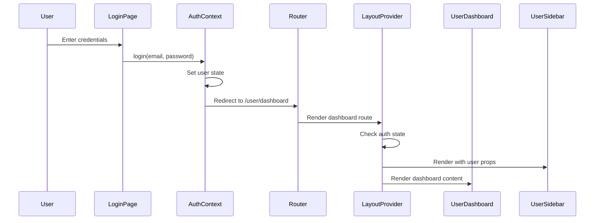

# Design Document: User Sidebar Integration

## Overview

This design document outlines the approach for integrating the user sidebar component into the main application layout and implementing proper redirection to the user dashboard upon successful authentication. The implementation will leverage the existing authentication context and layout provider to create a seamless user experience.

## Architecture

The feature will build upon the existing architecture of the TravelNRide application, which follows a Next.js-based structure with client-side components for layout management and authentication. The key components involved in this integration are:

1. **AuthContext** - Manages user authentication state and provides login/logout functionality
2. **LayoutProvider** - Controls which layout to render based on the current route and user state
3. **UserSidebar** - Displays user navigation options and user information
4. **RootLayout** - The top-level layout component that wraps all pages

The integration will maintain the separation of concerns while ensuring that components can access the necessary authentication state and user information.

## Components and Interfaces

### Modified Components

#### 1. LayoutProvider Component

The LayoutProvider will be enhanced to:
- Check authentication status using the AuthContext
- Conditionally render the UserSidebar when a user is authenticated
- Apply appropriate layouts based on route patterns and authentication state

```typescript
interface LayoutProviderProps {
  children: React.ReactNode
}
```

#### 2. UserSidebar Component

The UserSidebar component already accepts user information via props:

```typescript
interface UserSidebarProps {
  user?: {
    name: string
    email: string
    avatar?: string
  }
}
```

This interface will be maintained, with the user data being passed from the AuthContext through the LayoutProvider.

### Authentication Flow



## Data Models

The feature will utilize the existing User model from the AuthContext:

```typescript
interface User {
  id: string
  name: string
  email: string
  role: 'USER' | 'ADMIN'
  avatar?: string
  phoneNumber?: {
    isoCode: string
    countryCode: string
    internationalNumber: string
  }
  accountConfirmation?: {
    status: boolean
  }
  lastLoginAt?: string
  createdAt: string
}
```

No new data models are required for this integration.

## Error Handling

1. **Authentication Failures**
   - If authentication fails, appropriate error messages will be displayed to the user
   - The user will remain on the login page with form validation feedback

2. **Protected Route Access**
   - If an unauthenticated user attempts to access protected routes, they will be redirected to the login page
   - A message will inform them that authentication is required

3. **Layout Rendering Errors**
   - If there are errors in rendering the layout with the sidebar, a fallback layout will be used
   - Error boundaries will be implemented to prevent the entire application from crashing

## Testing Strategy

1. **Unit Tests**
   - Test the UserSidebar component with different user prop configurations
   - Test the LayoutProvider's conditional rendering logic

2. **Integration Tests**
   - Test the authentication flow from login to dashboard redirection
   - Test the sidebar rendering with authenticated and unauthenticated states

3. **End-to-End Tests**
   - Test the complete user journey from login to dashboard navigation
   - Verify that the sidebar displays correctly and navigation works as expected

## Implementation Considerations

1. **Performance**
   - The sidebar should be rendered efficiently to avoid layout shifts
   - Authentication state checks should be optimized to prevent unnecessary re-renders

2. **Responsive Design**
   - The sidebar integration must maintain the application's responsive behavior
   - On smaller screens, the sidebar should be collapsible or adapt appropriately

3. **Code Organization**
   - Changes should be minimal and focused on the specific components needed for the integration
   - Existing patterns and conventions should be followed for consistency